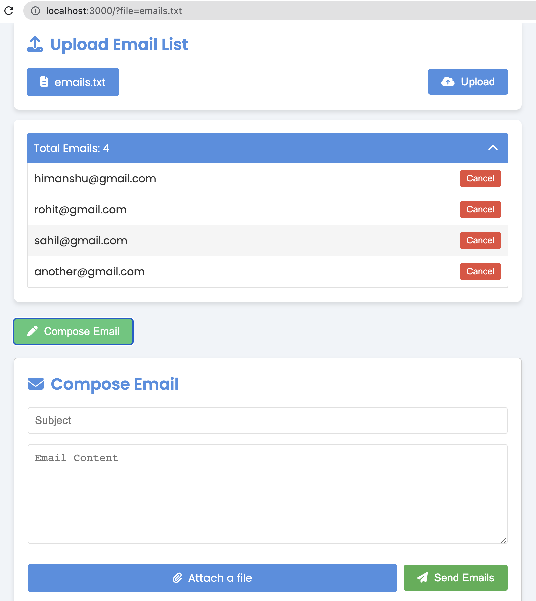

# Email Bot

Email Bot is a Node.js application that allows users to send bulk emails easily. It provides a simple web interface for uploading a list of email addresses, composing an email, and sending it to all the addresses in the list.



## Features

- Upload a text file containing email addresses
- View and edit the list of email addresses
- Compose emails with subject, content, and attachments
- Send emails to multiple recipients at once

## Prerequisites

- Node.js (v12 or higher)
- npm (Node Package Manager)
- A Gmail account (for sending emails)

## Installation

1. Clone the repository:
   ```
   git clone https://github.com/your-username/email-bot.git
   cd email-bot
   ```

2. Install dependencies:
   ```
   npm install
   ```

3. Create a `.env` file in the root directory and add your Gmail credentials:
   ```
   EMAIL_USER=your.email@gmail.com
   EMAIL_PASS=your_app_password
   ```
   Note: Use an App Password generated from your Google Account settings, not your regular Gmail password.

4. Start the server:
   ```
   npm start
   ```

5. Open a web browser and go to `http://localhost:3000` to use the application.

## Usage

1. Upload a text file containing email addresses (one per line).
2. Review the list of email addresses and remove any unwanted ones.
3. Click on "Compose Email" to open the email composition form.
4. Enter the subject and content of your email.
5. Optionally, attach a file to your email.
6. Click "Send Emails" to send the email to all addresses in the list.

## Security Note

This application is designed for personal or internal use. It uses environment variables to store sensitive information. Never commit your `.env` file to version control.

## License

This project is open-source and available under the MIT License.
